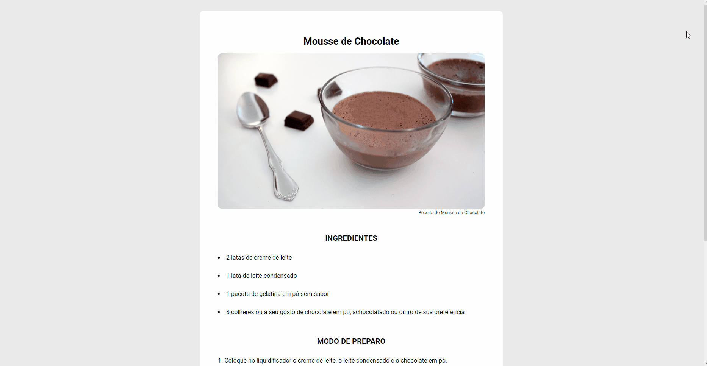

# Página de Receita

## 🎯 Desafio:

Neste desafio, foi proposto a criação de uma página de receita simples utilizando HTML e CSS.
 
### Layout disponibilizado:

 

## 🚀 Resultado: 

## ⚒️ Tecnologias utilizadas:
* JavaScript
* HTML
* CSS
